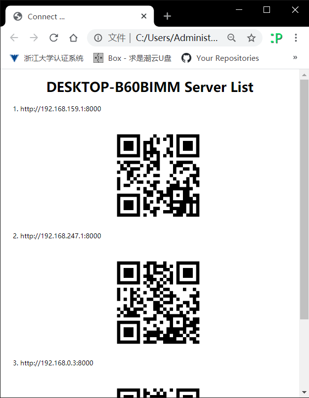
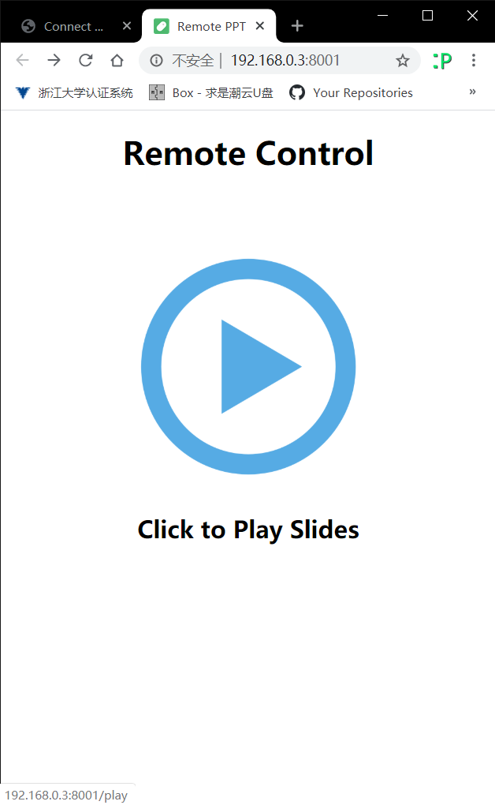
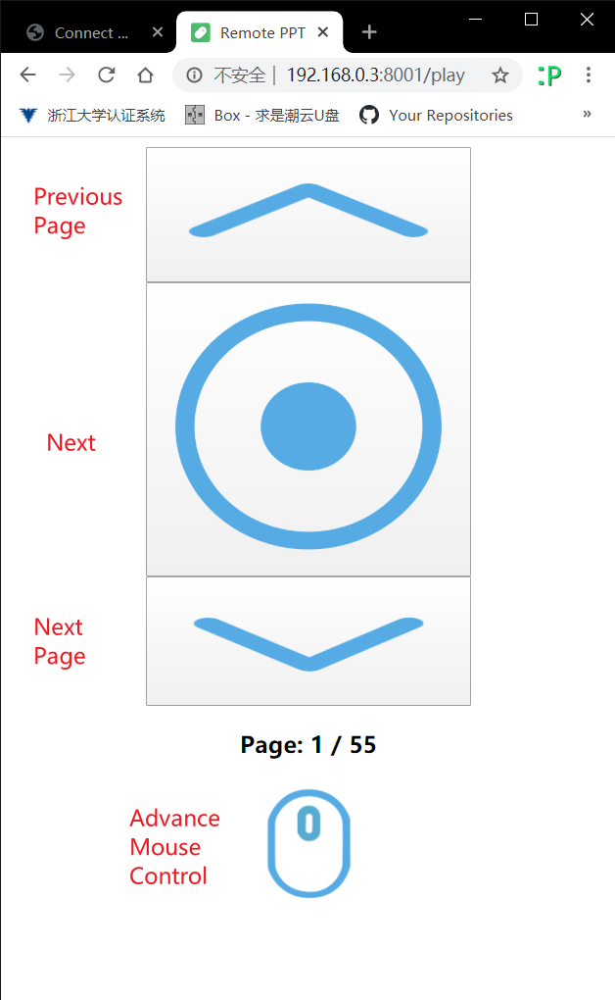
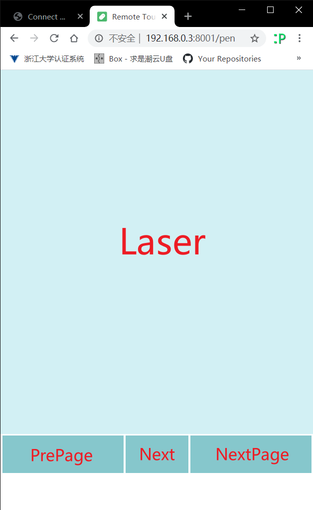

# WiFi Remote PPT Control

Run: 

```bash
# Open a .ppt(x) File, then
python main.py
```

You will get a tab like followings:




Choose the LAN both your client and computer both in, scan the QR code.

Click "Play" to play your slides.



Play Control Page




Advance Control Page:




Enjoy !


### Reference

* https://github.com/sharpdeep/WifiPPT
* https://github.com/mrrain345/remote-touchpad